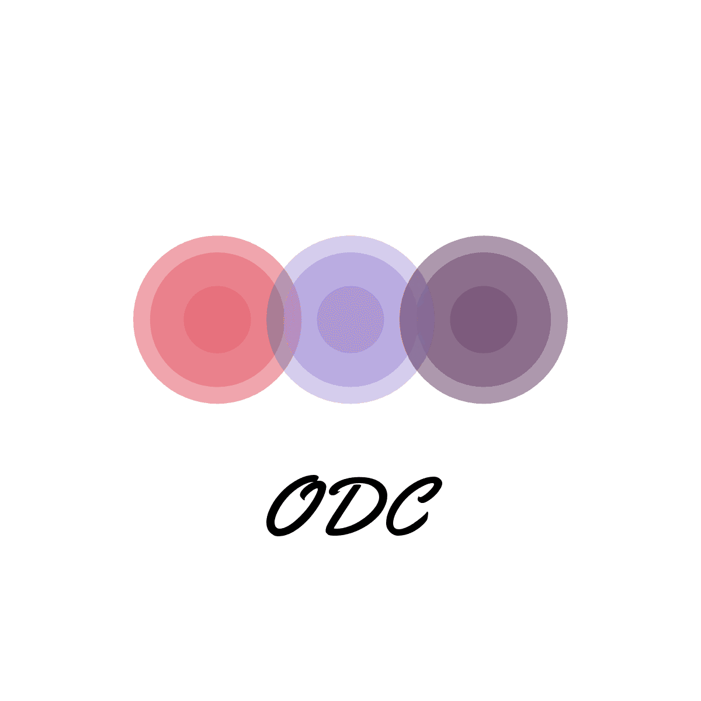

# :seedling:<ODC 프로젝트> 원데이 클래스 신청 사이트:seedling:

[KH정보교육원] 세미 프로젝트_ 원데이 클래스 신청 사이트 ODC

## 프로젝트 개요
자기 개발, 새로운 경험, 여가 생활 등을 위해 원데이 클래스를 찾는 사람들이 늘어나고 있다. 그러나 원데이 클래스의 모집 공고는 사업자의 개인 SNS에 모집 공고를 올려놓는 경우가 많기 때문에 소비자들은 가까운 곳에 어떤 클래스가 있는지, 후기와 가격은 어떤지 한눈에 비교하기가 어렵다. 따라서 ODC 프로젝트는 소규모 공방, 지역 상인들이 운영하는 원데이 클래스의 모집 공고와 정보를 한번에 제공하는 사이트를 구현함으로써 소비자들이 여러 클래스들의 정보와 후기를 살펴 자신이 원하는 클래스를 수강할 수 있도록 하는 서비스를 제공한다.

## 프로젝트 기간
2020.05.18 ~ 2020.07.03

## 주요 기능
1. 공통 : 로그인, 아이디/비밀번호 찾기, 이메일 인증(API), 네이버 소셜 로그인(API)
2. 관리자 : 회원/사업자 정보 조회, 클래스 상세정보 조회/관리(사이트 게시 여부 선택), 공지사항/후기 게시판 조회/수정/삭제, 사업자/관리자 수익 조회(아이디별, 날짜별 검색), 사업자 후원 내역 조회
3. 사업자 : 사업자 정보 조회/수정/탈퇴, 클래스 등록(첨부파일)/수정, 검수 상태 조회, 매출 현황 관리, 후원/문의내역/후기 게시판 관리
4. 사용자 : 사용자 정보 조회/수정/탈퇴, 수강 클래스 조회, 클래스 상세 정보(지도, 주소 API), 클래스 예약, 장바구니, 결제(아임포트 API), 후기/문의 작성, 인기/최신/지역/카테고리/재능기부별 클래스 조회(AJAX)

## 개발 환경
- O/S - Windows7 / Windows10
- WAS - Apache Tomcat 9.0.35
- DBMS - ORACLE 11g Express Edition Release 11.2.0
- Tool - Eclipse JEE-2020-03/ JDK 1.8 / SQL DEVELOPER
- 형상 관리 - GIT, Sourcetree

## 개발 언어
JAVA / JSP / JSTL / JavaScript / JQUERY / HTML5/CSS3 / SQL

## Pattern
MVC2
